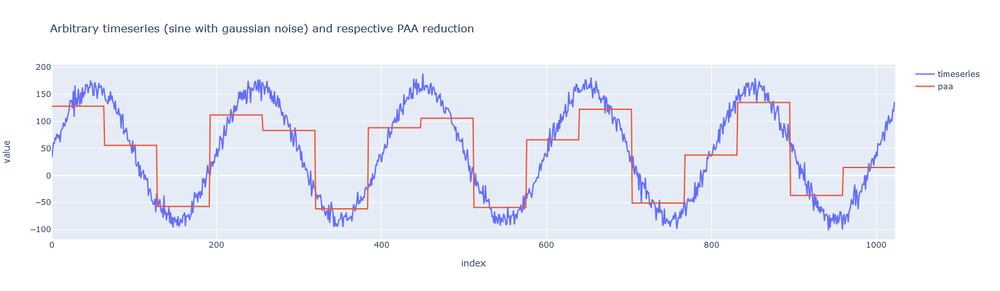

## SAX Dashboard
This project was part of an application and revolved around exploring the SAX (see e.g. [Symbolic Aggregate Approximation](https://jmotif.github.io/sax-vsm_site/morea/algorithm/SAX.html)) algorithm to compress timeseries data from potentially GB or TB of data to a simple symbolic representation (here a string).

I additionally tested FFT (Fast Fourier Transform. [3Blue1Brown](https://www.youtube.com/watch?v=spUNpyF58BY) or [Steve Brunton](https://youtu.be/E8HeD-MUrjY) made amazing videos for basic understanding of Fourier transforms and the FFT algorithm).

Finally I built a dashboard and deployed it to [Heroku](https://sax-dashboard.herokuapp.com/) where one can interactively play with key parameters of both algorithms, feel free to test it. Alternatively just clone this repo and run it locally.

### Piecewise Aggregate Approximation
The PAA algorithm reduces a timeseries of N datapoints to a series of M datapoints by averaging chunks of N/M datapoints.

The image below shows an example of PAA approximating a sine wave with gaussian noise using 16 chunks.

## Symbolic Aggregate Approximation
Whereas PAA reduces the number of datapoints in the timeseries, SAX reduces complexity by mapping the actual values (usually real numbers) to a fixed set of discrete values (symbols). By combining both algorithms even very large timeseries can be well represented by a string, potentially greatly reducing the complexity of the dataset.

This is done by setting breakpoints which define discrete ranges of values. These ranges each correspond to a symbol (most commonly characters of the alphabet). Example: with a single breakpoint at y=0 each negative datapoint will be categorized as 'a' and each positive datapoint as 'b'.

To ensure almost equiprobable symbols a common method is to choose breakpoints so that the area under a Gaussian N(mu=0, sigma=1) between two breakpoints is 1/a, where a is the total number of breakpoints. This can be easily done by using tabulated values if the timeseries is already z-normalized (translated to mean, scaled to standard deviation).

## Conclusions

## Fast Fourier Transform